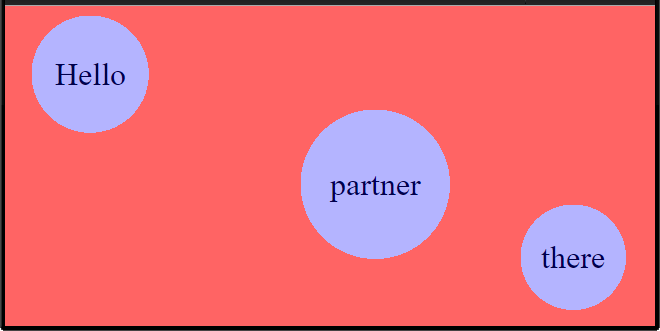

# JsHighlighter

JsHighlighter can be used to place a highlight layer above the current web page and draw circles around specified DOM elements.



The color of the background and of the circles can be specified in the constructor.


## Usage
Please see [sample](samples/index.html) for a working sample.

1) Include the `scripts/highlighter.js` and `scripts/external/pnglib.js` scripts in your `html/head` element.
```
<script type="text/javascript" language="javascript" src="../scripts/external/pnglib.js"></script>
<script type="text/javascript" language="javascript" src="../scripts/highlighter.js"></script>
```
2) Create an instance of a `Highlighter` object.
```
var highlighter = new Highlighter({
  'backgroundRed': 255,
	'backgroundGreen': 0,
	'backgroundBlue': 0,
	'backgroundAlpha': 155,
	'fillRed': 0,
	'fillGreen': 0,
	'fillBlue': 255,
	'fillAlpha': 75,
	'radiusMultiplier': 1.65,
	'loggingLevel': 'debug'
});
```
3) Call the `init(...)` function on the `highlighter` instance.
```
var highlightObjects = new Array();

var icon1 = document.getElementById('icon1');
var icon2 = document.getElementById('icon2');
var icon3 = document.getElementById('icon3');

highlightObjects.push(icon1);
highlightObjects.push(icon2);
highlightObjects.push(icon3);

highlighter.init(highlightObjects);
```
4) Call the `showHighlight()` function on the `highlighter` instance.
```
highlighter.showHighlight();
```


## Javascript Docs
### Constructor
This function will create a new instance of a Highlighter.

#### Parameters
##### configBlock
This JavaScript object can contain several attributes which
can be used to customize the look/feel of the highlighting
done by this Highlighter.

| Attribute Name | Description |
| -------------- | ----------- |
| backgroundRed | The color-code (0 - 255) for the red part of the background-color. |
| backgroundGreen | The color-code (0 - 255) for the green part of the background-color. |
| backgroundBlue | The color-code (0 - 255) for the blue part of the background-color. |
| backgroundAlpha | The color-code (0 - 255) for the alpha part of the background-color. |
| fillRed | The color-code (0 - 255) for the red part of the portal fill-color. |
| fillGreen | The color-code (0 - 255) for the green part of the portal fill-color. |
| fillBlue | The color-code (0 - 255) for the blue part of the portal fill-color. |
| fillAlpha | The color-code (0 - 255) for the alpha part of the portal fill-color. |
| radiusMultiplier | The multiplier to be used to determine the amount to multiply the radius by, to give extra padding around each portal. ```Ex: 1.5 would make the radius 50% larger than required to eclipse the DOM elements.```|

### init(...) Function
This function will build an image URL that is the size of the current window and place transparent holes within the image at the locations of the specified objects to be highlighted.

#### Parameters
##### highlightObjects
The array of DOM elements that are to be highlighted.

### clear() function
This function will clear the currently loaded objects and remove the highlight panel.

### showHighlight() function
This function will show the highlight panel and add a window-resize handler which will ensure that the highlight panel is kept up-to-date.
